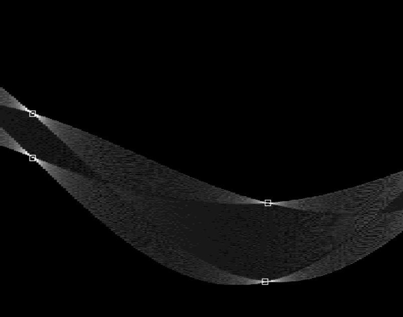

# Edge Detection via Canny Edge Detector

- [Image and Ndarray](#image-and-ndarray)
- [Manipulate Ndarrays](#manipulate-ndarrays)
	- [Array attributes](#array-attributes)
	- [Array creation](#array-creation)
	- [Arithmetic operation](#arithmetic-operation)
	- [Reshaping / indexing / slicing /](#reshaping-indexing-slicing-)
- [Edge Detection via Canny Edge Detector](#edge-detection-via-canny-edge-detector)
	- [Gaussian smooth](#gaussian-smooth)
	- [Sobel operator](#sobel-operator)
	- [Non-maximum suppression](#non-maximum-suppression)
	- [Thresholding](#thresholding)
	- [Hough Transform](#hough-transform)
- [Assignment](#assignment)

Please read this [Python Setup](SetupPython.html) instruction before getting started.

<!-- ## Read & Write Image
[Pillow](https://pillow.readthedocs.io/en/stable/handbook/tutorial.html) (PIL) provides basic functions for image read & write. We can read/display/write image by `open`, `show` and `save` like this:

```python
# load image
from PIL import Image
import numpy as np
img = Image.open('road.jpeg')

# display the image
img.show()

# save to file
img.save('road2.jpeg')
``` -->
## Image and Ndarray

In digital computer, colour images are represented as 3-d arrays. Each element of the array is a 8-bit integer, ranged in [0, 255]. The three dimensions are height, width, and channels respectively. The whole array has shape
$$(Height \times Width \times Channels).$$

<center>

</center>

NumPy is the de facto standard library of ndarray arithmetic in python. Nearly all image processing in this course is performed via NumPy, so in most time images is represented as `numpy.ndarray` object. `PIL.image` is involved only in reading/writing image files. A typical image processing program using NumPy and PIL looks like:

```python
from PIL import Image # pillow package
import numpy as np

img = Image.open('a.jpg')               # read image file
arr = np.asarray(img, dtype=np.float64) # convert to np.ndarray

# process the array here, e.g.
arr = arr/2

arr = arr.astype(np.uint8) # make sure dtype is uint8
img = Image.fromarray(arr) # convert back to PIL.image object
img.save('b.jpg')          # save to file
```

I have provided three useful function to help you read/write/show ndarrays as images in `edge.py`:
- `read_img_as_array(file)`
- `save_array_as_img(arr, file)`
- `show_array_as_img(arr)`

## Manipulate Ndarrays
NumPy provides nearly all array operation you can imagine, including
- arithmetic operation
    - addition, subtraction, multiplication, and division,
    - sin/cos/tan/exp/power/log,
- indexing, slicing, stacking, concatenation, and shape manipulation
- matrix multiplication,
- etc.

This 30-minute official [NumPy tutorial](https://numpy.org/devdocs/user/quickstart.html) will give you a quick overview of NumPy. You need it in both this assignment and future assignments, so please read it yourself after class. Here, I only cover several important parts of the tutorial to help you handle this assignment.

### Array attributes
Every ndarray has following three attributes -- `shape`, `dtype` and `ndim`.
- `dtype` indicates whether underlying elements are integers or floating point number and how many bits they have.
- `shape` indicates the shape of the ndarray., e.g, the number of rows and columns of matrix, the length of a vector, etc. A color image usually has shape $(H, W, C)$.
- `ndim` are the dimension number of the array.
    - `ndim==0`: scalar,
    - `ndim==1`: vector,
    - `ndim==2`: matrix.
    - `ndim>=3`: multi-dimensional array, or say, tensor.
```python
# Create array from list
a = np.array([[1, 2],
              [5, 6]])

a.shape # (2,2)
a.dtype # int64 -- 64-bit integer
a.ndim  # 2, means it is a matrix.
```
### Array creation
Create an all one matrix of shape 2x3:
```python
a = np.ones([2,3])  # all one matrix of shape 2x3
# array([[1., 1., 1.],
#        [1., 1., 1.]])
```
The default dtype is `float64` (double), you can specify other dtype:
```python
a = np.ones([2,3], dtype=np.int32)  # all one matrix of 32-bit integers
# array([[1, 1, 1],
#        [1, 1, 1]], dtype=int32)
```

Create all zero matrix of shape 3x2:
```python
a = np.zeros([3,2]) # all zero matrix of shape 3x2
# array([[0., 0.],
#        [0., 0.],
#        [0., 0.]])
```
Create matrix of shape 2x2 with unknown value:
```python
a = np.empty([2,2]) # matrix of shape 2x2 with unknown value
# e.g.
# array([[2.31584178e+077, 2.31584178e+077],
#        [2.96439388e-323, 6.93989086e-310]])
```
Create an array from 0 to 5, (6 elements in total):
```python
a = np.arange(6)
# array([0, 1, 2, 3, 4, 5])
```
### Arithmetic operation
Added by a number --- all elements will be added that number:
```python
a = np.array([[1, 2],
              [5, 6]])

a + 1   # addition
# result:
# array([[2, 3],
#        [6, 7]])

# subtraction, multiplication, and division are same.
a - 1.5 # subtraction
a * 5   # multiplication
a / 3   # division
```

Added by a row/column vector -- all rows/columns will be added the vector. Subtraction, multiplication, and division are same.
```python
# row vector
a + [2,100]
# array([[  3, 102],
#        [  7, 106]])

b = [[  2],
     [100]]
a + b
# array([[  3,   4],
#        [105, 106]])
```

Added by an array with same shape. The addition will be performed element by element. Subtraction, multiplication, and division are same.
```python
b = np.array([[10, 30],
              [20, 40]])
a + b   # element-wise addition
# array([[11, 32],
#        [25, 46]])
```

Take sin/square/sqrt/power/exponiential/logarithm of each element:
```python
np.sin(a)      # a_ij = sin(a_ij), sine
np.square(a)   # a_ij = (a_ij)^2, square
np.sqrt(a)     # a_ij = √(a_ij), square root
np.power(a, 5) # a_ij = (a_ij)^5, arbitrary power
np.exp(a)      # a_ij = e^(a_ij), exponiential
np.log(a)      # a_ij = log(a_ij), logarithm
```

### Reshaping / indexing / slicing /
You can change an array's shape via `reshape`:
```python
a = np.arange(9)
# array([0, 1, 2, 3, 4, 5, 6, 7, 8])

a = a.reshape(3,3)
# array([[0, 1, 2],
#        [3, 4, 5],
#        [6, 7, 8]])
```

Access one element (indexing):
```python
a[0,1]     # zeroth row, first column

a[0,0] = 5 # assignment: a_00 = 5
```

Access a block (slicing):
```python
# select first two rows and first two columns
a[0:2, 0:2]
# array([[0, 1],
#        [3, 4]])

a[0, :] # zeroth row
a[:, 2] # second column

# select a single channel
R = arr[:, :, 0] # red channel
G = arr[:, :, 1] # green channel
B = arr[:, :, 2] # blue channel

# horizontal derivative calculation
diff = R[:, 1:] - R[:, :-1]
```

## Edge Detection via Canny Edge Detector
As you have learnt, Canny edge detector contains following steps:
1. Gaussian Smoothing
2. Sobel Operator
3. Non-max suppression
4. Thresholding
5. Hough transform

__RGB to Greyscale__.
For simplicity, we only discuss grayscale image here. First, we need to convert colour image to grayscale image. A common used rgb-to-gray formula is:
$$Y = 0.2989 \; R + 0.5870 \; G + 0.1140 \; B $$
```python
# you may use 'rgb2gray' function in 'edge.py' directly.
R = arr[:, :, 0] # red channel
G = arr[:, :, 1] # green channel
B = arr[:, :, 2] # blue channel
gray = 0.2989*R + 0.5870*G + 0.1140*B
```

__Convolution__ via `ndimage.convolve`. Gaussian smooth and sobel involves convolution. Here is an example for general convolution:
$$\begin{bmatrix}
-1 & 1 \\
-1 & 1
\end{bmatrix} * gray$$
```python
from scipy import ndimage
weights = [[-1, 1],     # kernel / filter
           [-1, 1]]
diff = ndimage.convolve(gray, weights)
```

### Gaussian smooth
You may manually define your own gaussian kernel and apply it by `ndimage.convolve`. You can also use `ndimage.gaussian_filter` directly.
```python
# define the gaussian kernel by hand
gauss = np.array([[1, 2, 1],
                  [2, 4, 2],
                  [1, 2, 1]])
gauss = gauss/gauss.sum() # normalize the sum to be 1
out = ndimage.convolve(gray, gauss)

# or use 'ndimage.gaussian_filter' function
# the bigger sigma is, the smoother output is.
out = ndimage.gaussian_filter(gray, sigma=3)
```

### Sobel operator

Given an image $A$ of shape $(H, W)$, Sobel operator computes magnitude of gradient of $A$ as follow:
$$
G_x = A*\begin{bmatrix}
+1 & 0 & -1 \\
+2 & 0 & -2 \\
+1 & 0 & -1
\end{bmatrix}
\qquad\qquad
G_y = A*\begin{bmatrix}
+1 & +2 & +1 \\
 0 &  0 &  0 \\
-1 & -2 & -1
\end{bmatrix}
$$

$$G = \sqrt{G_x^2 + G_y^2}$$

This one is left for you to implement. Please compete `sobel` function in file `edge.py`. You may need `np.square` and  `np.sqrt` to calculate squares and square roots.

### Non-maximum suppression
The output of Sobel operator has poor localization. Edges trigger response in multiple adjacent pixels, which makes it difficult to decide the precise location of edges. Intuitively, edge occurs where gradient reaches a maxima, so we need to suppress all non-maximum values in $G$, i.e., set them to 0.

<center>


</center>

We need to compare each gradient with its neighbours along normal direction of edges, which is just the gradient direction. We first normalize gradient to a unit vector (<span style="color:black">__black arrow__</span>).
$$\bar{G}_x = G_x/G$$
$$\bar{G}_y = G_y/G$$
$$\overrightarrow{g} = (\bar{G}_x, \bar{G}_y)$$
<!-- Then, two normal directions (__black arrows__) of the edge are
$$-\overrightarrow{g} = (+\bar{G}_x,\;+\bar{G}_y),$$
$$-\overrightarrow{g} = (-\bar{G}_x,\;-\bar{G}_y).$$ -->
The coordinates of two neighbours (<span style="color:blue">__blue dots__</span>) we need to compare are
$${p_1} = (x_0, y_0)+\overrightarrow{g} = (x_0 + \bar{G}_x,\; y_0 + \bar{G}_y),$$
$${p_2} = (x_0, y_0)-\overrightarrow{g} = (x_0 - \bar{G}_x,\; y_0 - \bar{G}_y).$$
Finally, we set $G[i,j]$ to 0, if it is not the biggest one among its neighbours. For all $i,j$, we set

$$ G[i, j] := \left\{\begin{array}{l}
    0, & \text{if}\; G[i, j] < G[i + \bar{G}_y, j + \bar{G}_x]; \\
    0, & \text{if}\; G[i, j] < G[i - \bar{G}_y, j - \bar{G}_x]; \\
    G[i,j], & \text{elsewise.}
\end{array} \right. $$
Here conversion between coordinates and array indices is a little bit confusing. $x$ is horizontal coordinate, so it is corresponding to $j$, the column index, not $i$. Similarly, $y$ is corresponding to $i$. Coordinate $(x,y)$ and array index $[i,j]$ has following relation:
$$\left\{\begin{matrix}x = j\\ y = i\end{matrix}\right.$$

In most case, coordinates of neighbours are not integers, so we need interpolation to get values of
$$G[i + \bar{G}_y, j + \bar{G}_x] \;\text{and}\; G[i - \bar{G}_y, j - \bar{G}_x].$$
Function [`ndimage.map_coordinates(input, indices)`](https://docs.scipy.org/doc/scipy/reference/generated/scipy.ndimage.map_coordinates.html) can help you calculate the interpolated value at given indices, e.g.,
```python
# get interpolated value at three indices
# [0.5, 0.5], [1.5, 3.5], [2.5, 4.5]
ndimage.map_coordinates(grey, [[0.5, 1.5, 2.5],
                               [0.5, 3.5, 4.5]])
```

### Thresholding
After finishing non-maximum suppression, next step is to binarize the gradient magnitude. In standard Canny edge detector, binarization involves Hysteresis thresholding and connectivity analysis. For simplicity, we only choose a single threshold and also ommit connectivity analysis in this experiment. Since gradient magnitude ranged range from 0 to $255\sqrt{2}\approx361$, you can choose any proper threshold in [0, 361]. For example:
```python
# threshold
t = 180

# binarize G
G[G<=t] = 0
G[G>t] = 255
```

### Hough Transform
After getting the edge map, now we want to recognize geometric shapes, such as straight lines, circles, ellipses, from the edge map. A classical method to do so is Hough Transform. In this section, we demonstrate how to recognize straight lines by Hough transform.

Shapes can be represented as equations with parameters, e.g., a kind of equation for straight line is
$$\rho = cos(\theta)\;x + sin(\theta)\;y.$$
There are two parameters in this equation, the distance to origin $\rho$ and the angle of normal direction $\theta$. The range of $\theta$ is $[0, \pi]$; and range of $\rho$ is $[-D, +D]$, where $D=\sqrt{H^2+W^2}$ is the length of the diagonal of the image.
<center>

</center>

Given a point $(x_0, y_0)$, the parameters of all straight lines passing through this point satisfy equation
$$\rho = cos(\theta)\;x_0 + sin(\theta)\;y_0.$$
For a straight line with parameters $(\rho_0, \theta_0)$, if $n$ points $(x_1, y_1), (x_2, y_2), ..., (x_n, y_n)$ are all on this line, then the corresponding $n$ function curves in $\rho$-$\theta$ space
$$
\begin{matrix}
\rho = cos(\theta)\;x_1 + sin(\theta)\;y_1, \\
\vdots \\
\rho = cos(\theta)\;x_n + sin(\theta)\;y_n,
\end{matrix}
$$
intersect at point $(\rho_0, \theta_0)$.

Thus we can design a voting procedure to elect the most possible straight lines as follows:
1. Discretize $\rho$-$\theta$ space into a grid of cells, so that there are only finite number of candidates. A proper discretization for $\theta$ may be dividing $[0, \pi]$ into 100-1000 parts. For $\rho$, 1 should be a proper cell length.
2. Each edge point $(x, y)$ votes for $(b,\theta)$ cells which function $\rho = cos(\theta)\;x + sin(\theta)\;y$ passing through (<span style="color:blue">blue cells</span>). The more votes a cell gets, the more likely there is a straight line on the edge map $G$.
3. Find local maximum. After voting, you will get a voting result like following picture, then we need to find local maximums. Please compare each cell with its 8 neighbours. If the cell got most votes among neighbours, it is a local maximum, and you probably find an straight line, but you still need consider absolute value of its votes. The more votes, the more likely.

<center>

</center>


# Assignment

Implement Canny edge detector and detect straight lines in `road.jpeg`. Your program should contain following steps:

1. Convert colour image into grayscale image. (1 point)
2. Perform Gaussian smoothing, save the result as `gauss.jpg`. (2 points)
3. Apply sobel operator, save the x-gradient $G_x$, y-gradient $G_y$ and magnitude $G$ as `G_x.jpg`, `G_y.jpg` and `G.jpg`. (3 points)
4. Non-maximum value suppression. Save suppression result as `supress.jpg`. (4 points)
5. Thresholding. Choose a proper threshold, then binarize your suppression result. Save binarization result as `edgemap.jpg`. (1 point)
6. Hough Transform. Save the "voting" result as `hough.jpg`. (3 points)
7. Find out several most possible straight lines. Draw them on original image, then save as `detection_result.jpg`.  To draw lines on image, see [this example](https://stackoverflow.com/questions/13053443/drawing-a-line-on-an-image-with-pil). (1 point)

Your submission should contain:
1. All your intermediate results (images you are asked to save).
2. A runnable program `edge.py` that can reproduce your results.

Please submit before __23:59 on November 1th (Sunday)__. You may submit as many times as you want, but only your latest submission will be graded.
